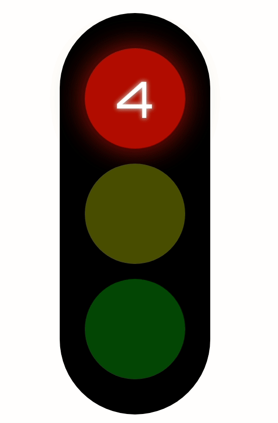
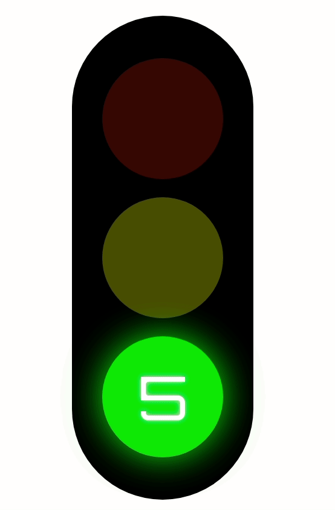
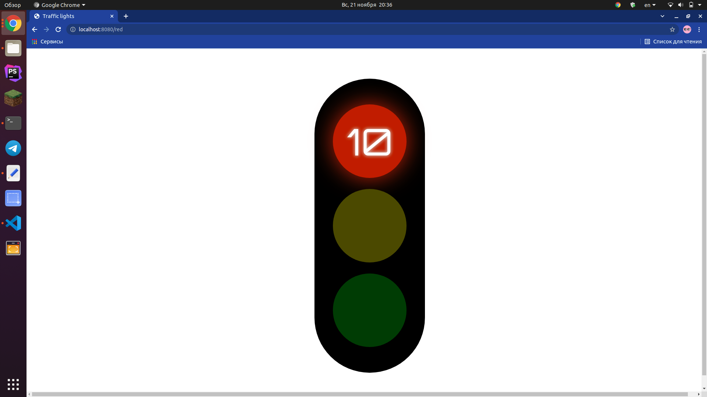
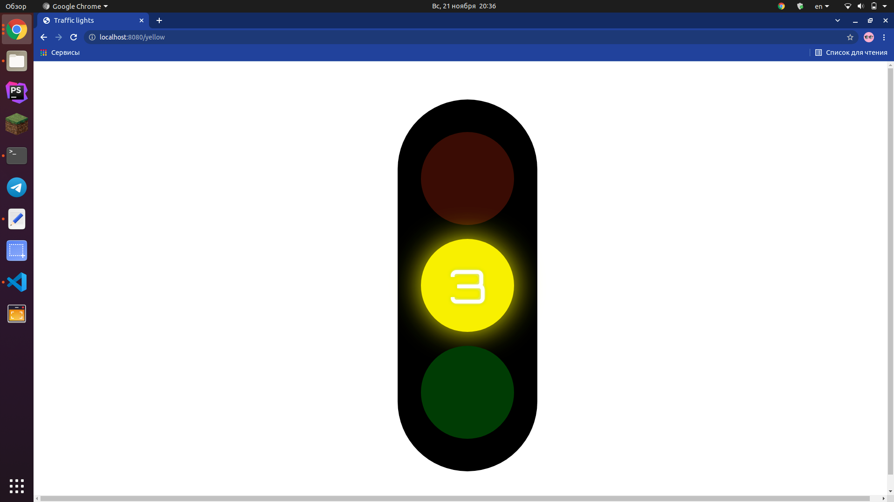
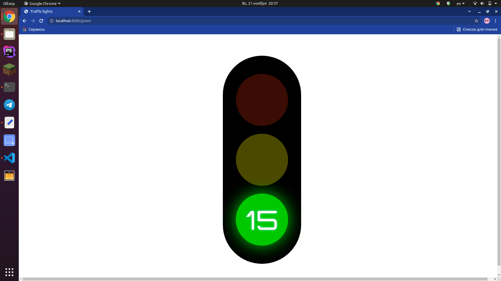
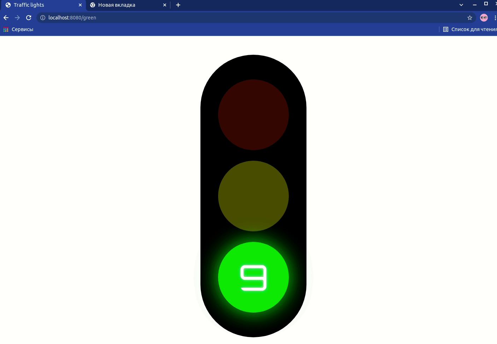

# Traffic-lights

Тестовое задание для компании TrueConf

## Описание проекта

Проект представляет собой светофор.

### Первое посещение
При первом входе на сайт происходит переадресация на /red - страницу красного света светофора и запускается бесконечный цикл светофора (красный-желтый-зеленый-желтый-красный)

### Таймер
У каждого огня светофора есть свой таймер, по истечению которого происходит смена цвета.

Когда на таймере остается меньше 3 секунд, свет текущего огня начинает мигать (кроме желтого)





### Роуты
У каждого огня светофора свой роут:
- Красный - /red


- Желтый - /yellow


- Зеленый - /green


При запросе на роут светофора, заново запускатеся цикл светофора с цвета текущего роута.

###  Перезагрузка страницы / Повторное посещение
При перезагрузке страницы или при повторном посещении страницы, светофор продолжит свою работу с того места на котором остановился


## Основные команды

### Установка зависимостей проекта
```
yarn install
```

### Запуск проекта
```
yarn serve
```

### Сборка проекта
```
yarn build
```
